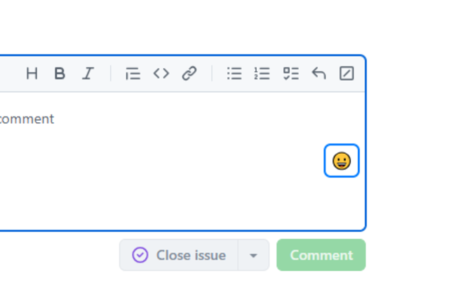
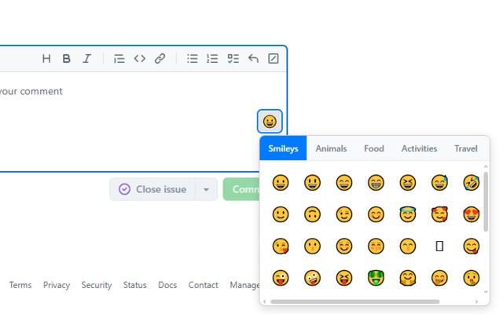

# Emoji Picker for Text Fields 🎯😀

A lightweight, seamless Google Chrome extension (Manifest V3) that injects an intuitive emoji picker into any text field or textarea across the web.

---

## ✨ Features

- **🌐 Works Everywhere**: Injects a discreet emoji button (`😀`) inside text inputs (`text`, `email`, `search`, `url`) and `textarea` fields across any website.
- **📚 Categorized Emoji Library**: Browse hundreds of emojis neatly organized across 7 categories:
  - 😃 **Smileys & Emotions**
  - 🐶 **Animals & Nature**
  - 🍎 **Food & Drink**
  - ⚽ **Activities & Sports**
  - 🚗 **Travel & Places**
  - 📱 **Objects**
  - ❤️ **Symbols**
- **⚡ Modern Framework Support**: Compatible with React, Vue, Angular, and vanilla web apps using resilient dual-injection (`document.execCommand` with synthetic input event fallbacks).
- **🔄 Dynamic DOM Observer**: Powered by `MutationObserver` to automatically detect dynamically added input fields and SPAs (Single Page Applications) without needing a page refresh.
- **🌓 Dark Mode & Responsive Design**: Automatically adapts to system dark/light mode themes and mobile/tablet viewport sizes.
- **⌨️ Keyboard Accessible**: Quick dismissal with the `Escape` key and outside-click detection.
- **🪶 Ultra-light & Privacy Friendly**: Zero external dependencies, runs 100% locally in your browser with no tracking or data collection.

---

## 📸 Screenshots

| Emoji Picker in Action | Category Selection |
| :---: | :---: |
|  |  |

---

## 🚀 Installation

### Load as Unpacked Extension (Developer Mode)

1. **Clone or Download** this repository:
   ```bash
   git clone https://github.com/ishandutta2007/emoji_extension.git
   ```
2. Open Google Chrome (or any Chromium-based browser such as Brave, Edge, or Opera).
3. Navigate to `chrome://extensions/` in the address bar.
4. Enable **Developer mode** toggle in the top-right corner.
5. Click **Load unpacked** in the top-left corner.
6. Select the cloned `emoji_extension` folder.
7. 🎉 The extension is now active! Visit any website with input fields to start using it.

---

## 📖 How to Use

1. Click on any text box or input field on any webpage.
2. Click the **😀 emoji icon** located inside the right side of the input field.
3. Switch between categories using the top navigation bar.
4. Click on any emoji to insert it at your current cursor position.
5. Press `Esc` or click anywhere outside to close the picker.

---

## 📁 Project Structure

```plaintext
emoji_extension/
├── icons/                  # Extension icons (16px, 48px, 128px, 256px)
├── screenshots/            # Showcase screenshots
├── manifest.json           # Chrome Extension Manifest V3 configuration
├── content.js              # Content script injecting emoji buttons & handling logic
├── styles.css              # Styling for picker popup, buttons, and dark mode
└── README.md               # Project documentation
```

---

## 🛠️ Built With

- **JavaScript (Vanilla ES6+)** — Fast and dependency-free execution
- **HTML5 & CSS3** — CSS Grid, Flexbox, and CSS Media Queries (`prefers-color-scheme`)
- **Chrome Extensions API (Manifest V3)**

---

## 🤝 Contributing

Contributions, issues, and feature requests are welcome!
Feel free to check the [issues page](https://github.com/ishandutta2007/emoji_extension/issues).

1. Fork the Project
2. Create your Feature Branch (`git checkout -b feature/AmazingFeature`)
3. Commit your Changes (`git commit -m 'Add some AmazingFeature'`)
4. Push to the Branch (`git push origin feature/AmazingFeature`)
5. Open a Pull Request

---

## 📄 License

Distributed under the MIT License. See `LICENSE` for more information.
